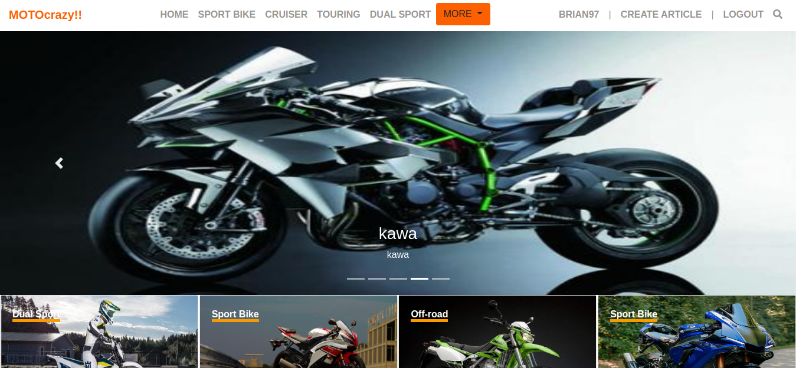
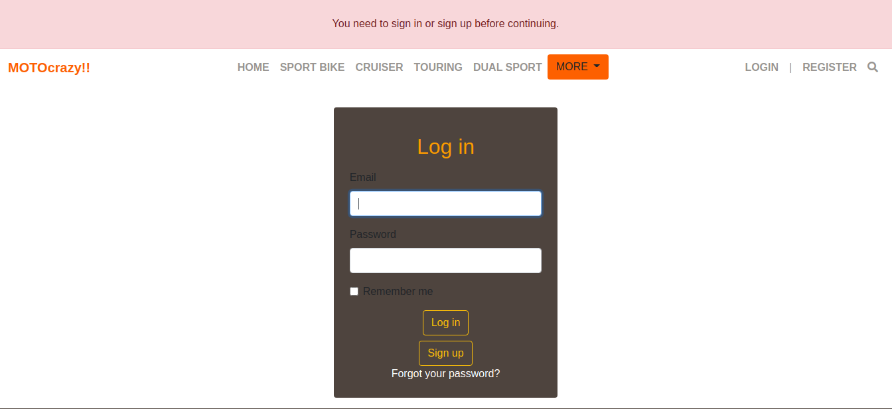
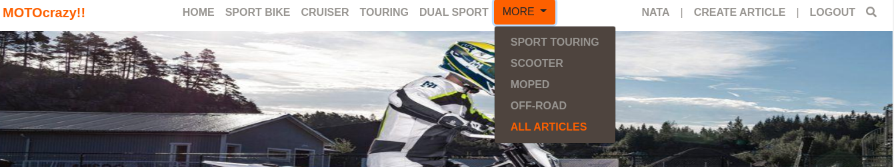
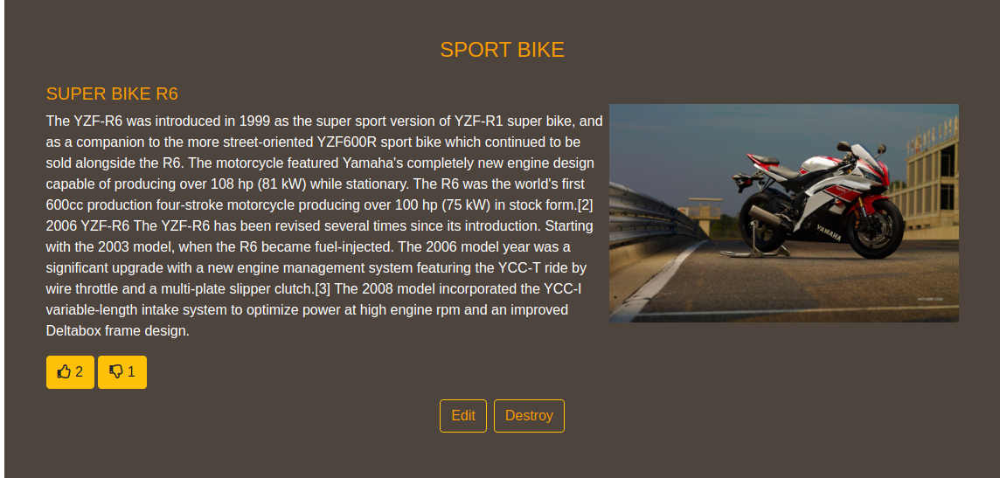

# Rails Capstone

This is the Ruby on Rails capstone project that is based on lifestyle articles website. I personalize the content to be a motorcycles articles. 

You can see the original design [here](https://www.behance.net/gallery/14554909/liFEsTlye-Mobile-version)
Design idea by [Nelson Sakwa on Behance](https://www.behance.net/sakwadesignstudio)

On the navbar, I include a button for more categories because I want to include all the categories existing for the topic.
In the original project, the forms, and the article doesn't have design, so I created my designs trying to follow the guidelines of the given design.

## Live demo

[live demo](https://rocky-gorge-53007.herokuapp.com/)

## Video

[Loom video](https://www.loom.com/share/cde6ff53ac5b4879838f462af8523dad)

## Built With

- Ruby
- Ruby on rails
- Capybara / Rspec

## Pre-requisites

- Ruby 2.7.0
- Rails gem
- Bundle

## How to start the project from your Local enviroment

- Open your terminal and cd where you want to store the project
- Run the following command - `git clone https://github.com/BrianSammit/Rails_capstone.git`
- Cd into the directory - `cd Rails_capstone`
- Then run `Bundle install`
- Run `rails db:migrate`
- Run `rails db:seed`
- Run `rails server` or `rails s`
- Open your browser
- Type `http://localhost:3000/`

## How to test it

- Open your terminal 
- Cd into the directory - `cd Rails_capstone` 
- Then run `rspec`
- You should see the test results. 

## Author

👤 **Brian Cruz**

- Github: [@githubhandle](https://github.com/BrianSammit)
- Twitter: [@twitterhandle](https://twitter.com/cruzsammit)
- Linkedin: [linkedin](https://www.linkedin.com/in/brian-sammit-cruz-rodriguez-5877551a8/)

## 🤝 Contributing

Contributions, issues and feature requests are welcome!

Feel free to check the [issues page](https://github.com/BrianSammit/Rails_capstone/issues).

## Show your support

Give a ⭐️ if you like this project!

## Acknowledgments

- The Odin Project
- Rails guides
- Microverse

## 📝 License

This project is [MIT](lic.url) licensed.![]
